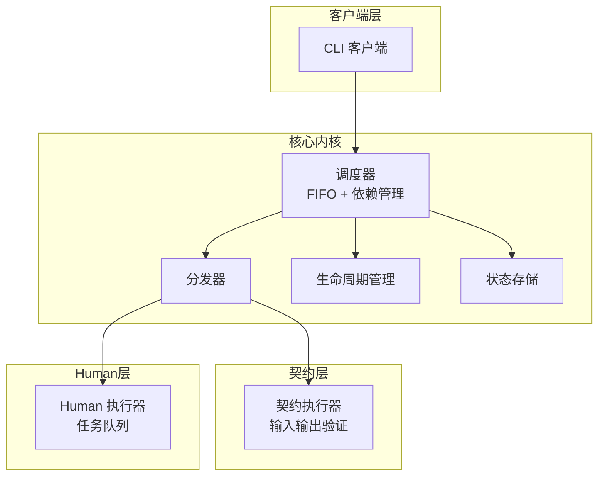
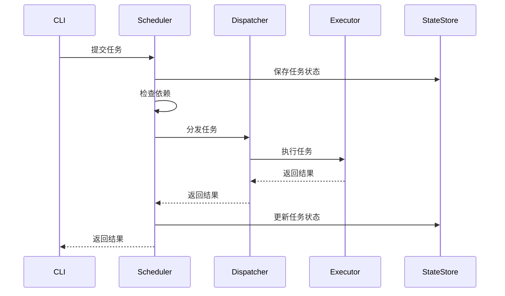
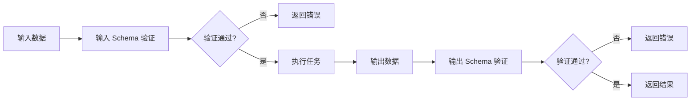
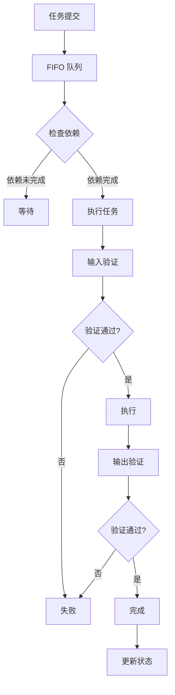
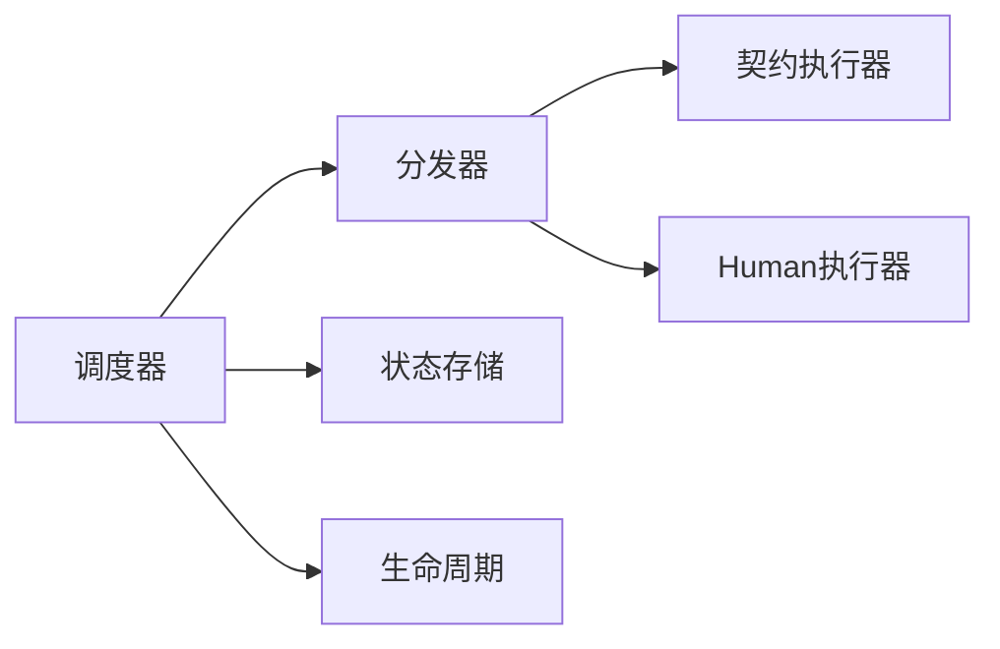
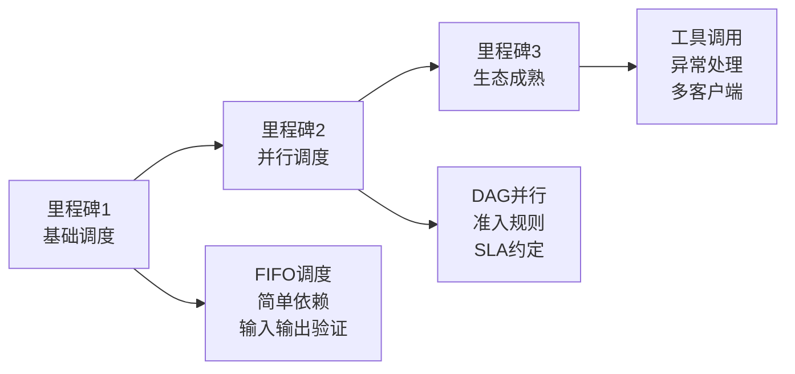

# 系统架构可视化

## 1. 系统整体架构

```mermaid
graph TB
    subgraph 客户端层
        CLI[CLI 客户端]
    end

    subgraph 核心内核
        Scheduler[调度器<br/>FIFO + 依赖管理]
        Dispatcher[分发器]
        Lifecycle[生命周期管理]
        StateStore[状态存储]
    end

    subgraph 契约层
        ContractExecutor[契约执行器<br/>输入输出验证]
    end

    subgraph Human层
        HumanExecutor[Human 执行器<br/>任务队列]
    end

    CLI --> Scheduler
    Scheduler --> Dispatcher
    Dispatcher --> ContractExecutor
    Dispatcher --> HumanExecutor
    Scheduler --> StateStore
    Scheduler --> Lifecycle
```

## 2. 任务调度流程

```mermaid
sequenceDiagram
    participant CLI
    participant Scheduler
    participant Dispatcher
    participant Executor
    participant StateStore

    CLI->>Scheduler: 提交任务
    Scheduler->>StateStore: 保存任务状态
    Scheduler->>Scheduler: 检查依赖
    Scheduler->>Dispatcher: 分发任务
    Dispatcher->>Executor: 执行任务
    Executor-->>Dispatcher: 返回结果
    Dispatcher-->>Scheduler: 返回结果
    Scheduler->>StateStore: 更新任务状态
    Scheduler-->>CLI: 返回结果
```

## 3. 契约验证流程

```mermaid
graph LR
    A[输入数据] --> B[输入 Schema 验证]
    B --> C{验证通过?}
    C -->|否| D[返回错误]
    C -->|是| E[执行任务]
    E --> F[输出数据]
    F --> G[输出 Schema 验证]
    G --> H{验证通过?}
    H -->|否| I[返回错误]
    H -->|是| J[返回结果]
```

## 4. 里程碑1核心工作流程

```mermaid
graph TB
    A[任务提交] --> B[FIFO 队列]
    B --> C{检查依赖}
    C -->|依赖未完成| D[等待]
    C -->|依赖完成| E[执行任务]
    E --> F[输入验证]
    F --> G{验证通过?}
    G -->|否| H[失败]
    G -->|是| I[执行]
    I --> J[输出验证]
    J --> K{验证通过?}
    K -->|否| H
    K -->|是| L[完成]
    L --> M[更新状态]
```

## 5. 系统模块关系

```mermaid
graph LR
    Scheduler[调度器] --> Dispatcher[分发器]
    Scheduler --> StateStore[状态存储]
    Scheduler --> Lifecycle[生命周期]
    Dispatcher --> ContractExecutor[契约执行器]
    Dispatcher --> HumanExecutor[Human执行器]
```

## 6. 里程碑演化路径

```mermaid
graph LR
    M1[里程碑1<br/>基础调度] --> M2[里程碑2<br/>并行调度]
    M2 --> M3[里程碑3<br/>生态成熟]

    M1 --> M1F[FIFO调度<br/>简单依赖<br/>输入输出验证]
    M2 --> M2F[DAG并行<br/>准入规则<br/>SLA约定]
    M3 --> M3F[工具调用<br/>异常处理<br/>多客户端]
```
