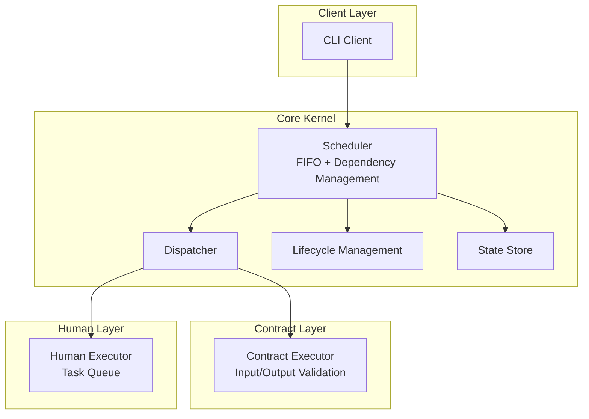
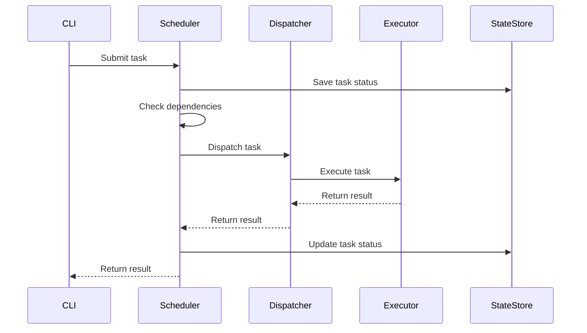
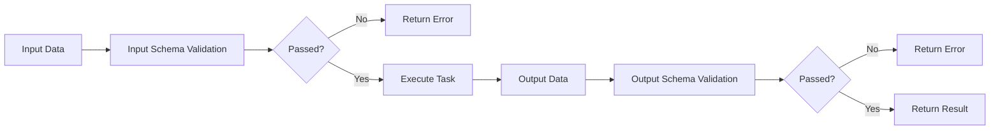
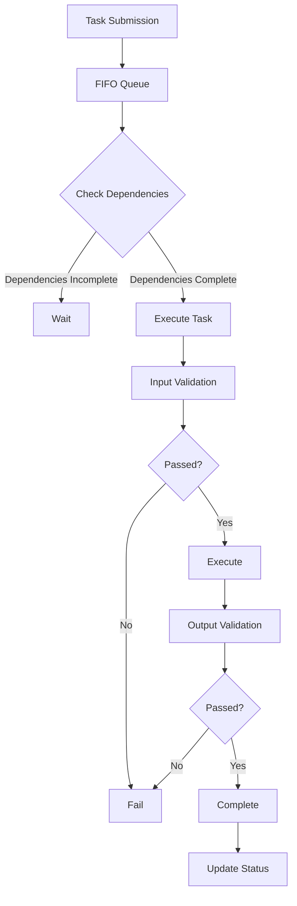
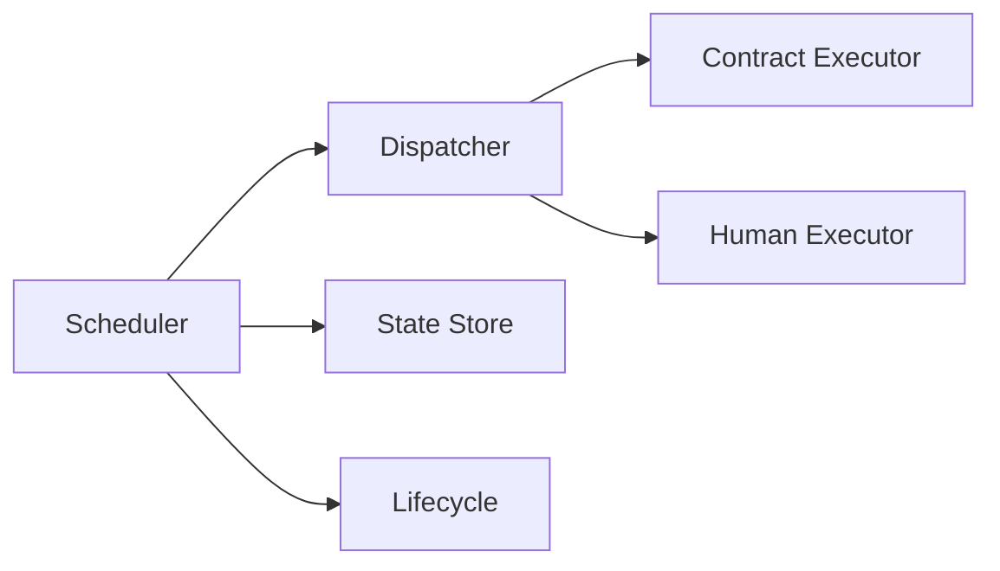
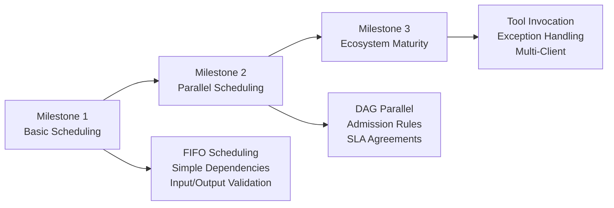

# System Architecture Visualization

## 1. Overall System Architecture

## 2. Task Scheduling Flow

## 3. Contract Validation Flow

## 4. Milestone 1 Core Workflow

## 5. System Module Relationships

## 6. Milestone Evolution Path

