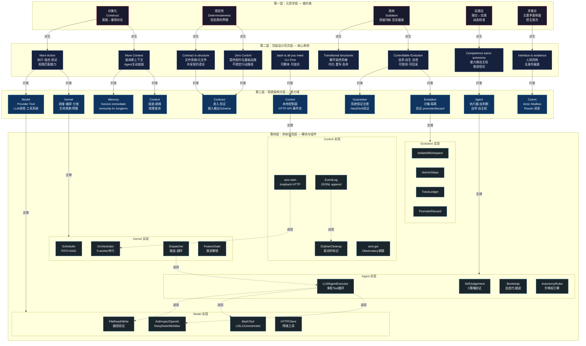

```mermaid
graph TD
    %% ═══════════════════════════════════════════════════════════
    %% 第一层：元哲学层（根约束）
    %% ═══════════════════════════════════════════════════════════
    subgraph L1["第一层：元哲学层 — 根约束"]
        direction LR
        P1["对象化<br/>Construct<br/>意图→客观存在"]
        P2["规定性<br/>Determinateness<br/>划定质的界限"]
        P3["扬弃<br/>Sublation<br/>保留内核·否定偏差"]
        P4["实践论<br/>理论↔实践<br/>动态校准"]
        P5["矛盾论<br/>主要矛盾侧面<br/>抓主放次"]
    end

    %% ═══════════════════════════════════════════════════════════
    %% 第二层：顶层设计范式层
    %% ═══════════════════════════════════════════════════════════
    subgraph L2["第二层：顶层设计范式层 — 核心原则"]
        direction LR
        D1["More Context<br/>查询即上下文<br/>Agent主动组装"]
        D2["More Action<br/>执行·组合·验证<br/>权限匹配能力"]
        D3["Zero Control<br/>提供契约与基础设施<br/>不规定行动路径"]
        D4["Controllable Evolution<br/>自举·自生·自改<br/>可观测·可回滚"]
        D5["bash is all you need<br/>CLI First<br/>可脚本·可组合"]
        D6["Interface is existence<br/>人机同构<br/>无身份偏差"]
        D7["Competence earns autonomy<br/>能力换自主权<br/>渐进信任"]
        D8["Contract is structure<br/>文件系统/元文件<br/>共享契约语言"]
        D9["Transitional structures<br/>脚手架终将被<br/>内化·重写·丢弃"]
    end

    %% ═══════════════════════════════════════════════════════════
    %% 第三层：系统架构分层层
    %% ═══════════════════════════════════════════════════════════
    subgraph L3["第三层：系统架构分层 — 能力域"]
        direction LR
        S1["Kernel<br/>调度·编排·分发<br/>生命周期·预算"]
        S2["Agent<br/>执行器·自判断<br/>自举·自主权"]
        S3["Model<br/>Provider·Tool<br/>LLM调用·工具系统"]
        S4["Contract<br/>准入·验证<br/>输入输出Schema"]
        S5["Context<br/>组装·就绪<br/>按需查询"]
        S6["Evolution<br/>沙箱·隔离<br/>验证·promote/discard"]
        S7["Memory<br/>horizon·immediate<br/>immunity·kv·longterm"]
        S8["Control<br/>本地控制面<br/>HTTP API·事件流"]
        S9["Comm<br/>Actor·Mailbox<br/>Router·消息"]
        S10["Guarantee<br/>系统保证注册<br/>Hard/Soft验证"]
    end

    %% ═══════════════════════════════════════════════════════════
    %% 第四层：具体实现层
    %% ═══════════════════════════════════════════════════════════
    subgraph L4["第四层：具体实现层 — 模块与组件"]
        direction LR
        subgraph K["Kernel 实现"]
            K1["Scheduler<br/>FIFO+DAG"]
            K2["Orchestrator<br/>5-worker并行"]
            K3["Dispatcher<br/>路由·超时"]
            K4["FeatureGate<br/>渐进解锁"]
        end
        subgraph A["Agent 实现"]
            A1["LLMAgentExecutor<br/>多轮Tool循环"]
            A2["SelfJudgement<br/>5策略验证"]
            A3["Bootstrap<br/>自迭代·跟进"]
            A4["AutonomyRules<br/>升降权引擎"]
        end
        subgraph M["Model 实现"]
            M1["Anthropic/OpenAI<br/>DeepSeek/MiniMax"]
            M2["BashTool<br/>L0/L1/Unrestricted"]
            M3["FileRead/Write<br/>路径验证"]
            M4["HTTPClient<br/>网络工具"]
        end
        subgraph CT["Control 实现"]
            CT1["axis start<br/>loopback HTTP"]
            CT2["EventLog<br/>JSONL append"]
            CT3["OrphanCleanup<br/>启动时标记"]
            CT4["axis-gui<br/>Observatory前端"]
        end
        subgraph EV["Evolution 实现"]
            EV1["IsolatedWorkspace"]
            EV2["AtomicSteps"]
            EV3["TraceLedger"]
            EV4["Promote/Discard"]
        end
    end

    %% ═══════════════════════════════════════════════════════════
    %% 层间关系：派生 / 约束 / 支撑
    %% ═══════════════════════════════════════════════════════════

    %% L1 → L2：元哲学派生设计原则
    P1 -->|"派生"| D1
    P1 -->|"派生"| D2
    P2 -->|"派生"| D3
    P2 -->|"派生"| D8
    P3 -->|"派生"| D4
    P3 -->|"派生"| D9
    P4 -->|"派生"| D7
    P5 -->|"派生"| D6

    %% L2 → L3：设计原则约束架构分层
    D1 -->|"约束"| S5
    D1 -->|"约束"| S7
    D2 -->|"约束"| S1
    D2 -->|"约束"| S3
    D3 -->|"约束"| S4
    D4 -->|"约束"| S6
    D4 -->|"约束"| S10
    D5 -->|"约束"| S8
    D6 -->|"约束"| S9
    D7 -->|"约束"| S2
    D8 -->|"约束"| S4

    %% L3 → L4：架构层支撑实现层
    S1 -->|"支撑"| K
    S2 -->|"支撑"| A
    S3 -->|"支撑"| M
    S8 -->|"支撑"| CT
    S6 -->|"支撑"| EV

    %% L4 内部调用关系
    K3 -.->|"调用"| A1
    A1 -.->|"调用"| M1
    A1 -.->|"调用"| M2
    A1 -.->|"调用"| M3
    CT1 -.->|"调用"| K2
    CT2 -.->|"调用"| CT3

    %% 样式
    classDef philosophy fill:#1a1a2e,stroke:#e94560,color:#fff
    classDef paradigm fill:#16213e,stroke:#0f3460,color:#fff
    classDef architecture fill:#0f3460,stroke:#53a8b6,color:#fff
    classDef implementation fill:#1b262c,stroke:#3282b8,color:#fff

    class P1,P2,P3,P4,P5 philosophy
    class D1,D2,D3,D4,D5,D6,D7,D8,D9 paradigm
    class S1,S2,S3,S4,S5,S6,S7,S8,S9,S10 architecture
    class K1,K2,K3,K4,A1,A2,A3,A4,M1,M2,M3,M4,CT1,CT2,CT3,CT4,EV1,EV2,EV3,EV4 implementation
```
