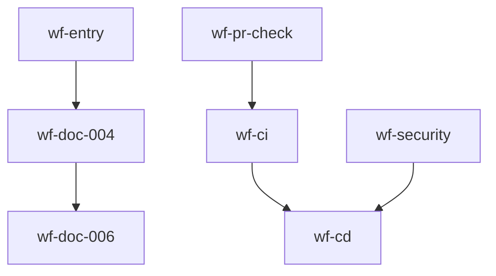

# 工作流索引

本文档只索引当前有效或仍需追溯的工作流。权威元数据以 `.github/config/registry.yml` 为准。

## 权威入口

- `workflow/entry.md`：任务到最小 workflow 组合的入口路由。
- `workflow/meta-workflow-management.md`：工作流维护规则与同步清单。
- `.github/config/registry.yml`：工作流状态、路径、依赖的机器可读注册表。

## 当前活跃的 GitHub Actions

| ID | 名称 | 文件路径 | 用途 |
|---|---|---|---|
| `wf-ci` | Continuous Integration | `.github/workflows/ci.yml` | format / vet / lint / test / build / docs generation |
| `wf-pr-check` | PR Quality Check | `.github/workflows/pr-check-workflow.yml` | PR 质量门禁、复杂度、文档检查 |
| `wf-doc-006` | Document Audit | `.github/workflows/document-audit.yml` | 文档审计 |
| `wf-security` | Security Scanning | `.github/workflows/security-workflow.yml` | 安全扫描 |
| `wf-cd` | Continuous Delivery | `.github/workflows/cd-workflow.yml` | tag 发布与交付 |
| `wf-monitoring` | Monitoring | `.github/workflows/monitoring-workflow.yml` | 轻量依赖健康检查 |

## 当前活跃的文档工作流

| ID | 名称 | 文件路径 | 用途 |
|---|---|---|---|
| `wf-entry` | Entry Point Routing | `workflow/entry.md` | 选择最小必要 workflow 组合 |
| `wf-doc-004` | Meta-Workflow Management | `workflow/meta-workflow-management.md` | 管理 workflow 规则、状态同步、入口一致性 |

## 已废弃或合并的工作流

| ID | 原名称 | 当前处理 | 原因 |
|---|---|---|---|
| `wf-dev` | Development Workflow | `docs/deprecated/dev-workflow.md` | 本地检查由 pre-commit / 手动命令承担，避免重复 CI |
| `wf-release` | Release Workflow | 合并到 `wf-cd` | 避免重复发布链路 |
| `wf-docs` | Documentation Automation Workflow | 合并到 `wf-ci` | docs generation 是 CI 的一部分 |
| `wf-occams` | Occam's Razor Architecture Simplification | 原则内置到 `wf-entry` / `wf-doc-004` | 不再作为独立 workflow 路由 |
| `wf-doc-001` | CI/CD Quality Improvement Workflow | `docs/deprecated/workflows/ci-cd-quality-improvement-workflow.md` | 早期 CI/CD 设置过程 |
| `wf-doc-002` | Software Engineering Paradigm Workflow Improvement | `docs/deprecated/workflows/software-engineering-paradigm-workflow-improvement.md` | 理论化且已失效 |
| `wf-doc-003` | Comprehensive Automation Workflows Architecture | `docs/deprecated/workflows/comprehensive-automation-workflows.md` | 过度设计，已简化 |
| `wf-doc-005` / `wf-doc-007` | Entry Point Workflow | `docs/deprecated/workflows/entry-workflow.md` | 旧调度器设计被 `workflow/entry.md` 替代 |

## 推荐路由

| 任务类型 | 最小 workflow 组合 |
|---|---|
| 功能实现 / Bug 修复 | `wf-pr-check + wf-ci + wf-doc-006` |
| 新功能 / 新规格 | `wf-doc-004 + wf-pr-check + wf-ci + wf-doc-006` |
| 文档 / 设计 / 工作流调整 | `wf-doc-004 + wf-doc-006` |
| CI/CD / 发布 / 安全 / 监控 | 对应自动化 workflow + `wf-doc-004` |

## 依赖关系

## 维护规则

1. 新增 workflow 前先读 `workflow/entry.md`，确认现有路由不足。
2. GitHub Actions 必须先有实际 `.yml` 文件，再在 registry 标记为 active。
3. 已删除或合并的 workflow 不得出现在“当前活跃”表中。
4. 经验类检查默认提醒，不升级为硬门禁。
5. 更新 workflow 时同步检查 `docs/status/current-progress.md`、`HANDOVER.md`、`AGENT_INSTRUCTIONS.md`。

## 相关文档

- [工作流入口路由](../workflow/entry.md)
- [Meta-Workflow 管理](../workflow/meta-workflow-management.md)
- [工作流注册表](../.github/config/registry.yml)
- [工作流最佳实践](../docs/workflow/workflow-best-practices.md)
- [工作流报告索引](../reports/README.md)
