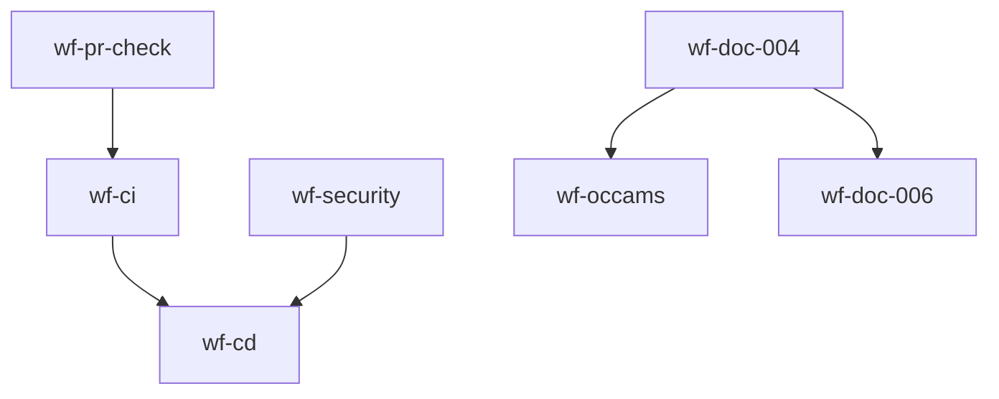

# 工作流索引

本文档提供了项目中所有工作流的快速索引。

---

## 活跃的 GitHub Actions 工作流

| ID | 名称 | 文件路径 | 状态 | 用途 |
|----|------|----------|------|------|
| wf-dev | Development Workflow | .github/workflows/dev-workflow.yml | ✅ 活跃 | 开发阶段检查（格式、lint、测试、构建） |
| wf-ci | Continuous Integration Workflow | .github/workflows/ci.yml | ✅ 活跃 | 持续集成（格式、vet、lint、测试、构建、文档生成） |
| wf-pr-check | PR Quality Check Workflow | .github/workflows/pr-check-workflow.yml | ✅ 活跃 | PR 质量检查（质量门禁、代码审查、文档检查） |
| wf-doc-006 | Document Audit | .github/workflows/document-audit.yml | ✅ 活跃 | 文档审计（格式、链接、内容一致性、里程碑对齐） |
| wf-security | Security Scanning Workflow | .github/workflows/security-workflow.yml | ✅ 活跃 | 安全扫描 |
| wf-cd | Continuous Delivery Workflow | .github/workflows/cd-workflow.yml | ✅ 活跃 | 持续交付 |
| wf-monitoring | Monitoring Workflow | .github/workflows/monitoring-workflow.yml | ✅ 活跃 | 监控 |
| wf-release | Release Workflow | .github/workflows/release.yml | ❌ 废弃 | 已合并到 cd-workflow.yml，避免重复发布链路 |

---

## 活跃的文档工作流

| ID | 名称 | 文件路径 | 状态 | 用途 |
|----|------|----------|------|------|
| wf-doc-004 | Meta-Workflow Management | workflow/meta-workflow-management.md | ✅ 活跃 | Meta-Workflow 管理文档 |
| wf-occams | Occam's Razor Architecture Simplification | workflow/occams-razor-architecture-simplification.md | ✅ 活跃 | 奥卡姆剃刀架构简化文档 |
| wf-entry | Entry Point Routing | workflow/entry.md | ✅ 活跃 | 用户任务到项目工作流的最小入口路由 |

---

## 废弃的工作流

| ID | 名称 | 文件路径 | 状态 | 废弃原因 |
|----|------|----------|------|----------|
| wf-doc-001 | CI/CD Quality Improvement Workflow | docs/deprecated/workflows/ci-cd-quality-improvement-workflow.md | ❌ 废弃 | 早期 CI/CD 设置过程，当前 CI/CD 已完成 |
| wf-doc-002 | Software Engineering Paradigm Workflow Improvement | docs/deprecated/workflows/software-engineering-paradigm-workflow-improvement.md | ❌ 废弃 | 理论化的 CI/CD 改进，与实际需求脱节 |
| wf-doc-003 | Comprehensive Automation Workflows Architecture | docs/deprecated/workflows/comprehensive-automation-workflows.md | ❌ 废弃 | 7 个核心工作流架构设计，已被简化 |
| wf-doc-007 | Entry Point Workflow | docs/deprecated/workflows/entry-workflow.md | ❌ 废弃 | 工作流调度器设计，过度设计不符合奥卡姆剃刀 |
| wf-docs | Documentation Automation Workflow | .github/workflows/ci.yml | ❌ 废弃 | docs job 是 CI workflow 的一部分，不需要单独条目 |
| wf-doc-005 | Entry Point Workflow | docs/deprecated/workflows/entry-workflow.md | ❌ 废弃 | 旧入口调度器设计过度复杂，已由 workflow/entry.md 替代 |
| wf-release | Release Workflow | .github/workflows/release.yml | ❌ 废弃 | 已合并到 cd-workflow.yml，避免重复发布链路 |

---

## 工作流分类

### 开发工作流
- wf-dev - Development Workflow

### 持续集成工作流
- wf-ci - Continuous Integration Workflow

### 质量保证工作流
- wf-pr-check - PR Quality Check Workflow

### 文档工作流
- wf-doc-006 - Document Audit
- wf-doc-004 - Meta-Workflow Management
- wf-occams - Occam's Razor Architecture Simplification
- wf-entry - Entry Point Routing

### 安全工作流
- wf-security - Security Scanning Workflow

### 持续交付工作流
- wf-cd - Continuous Delivery Workflow
- wf-release - Release Workflow（废弃，保留索引用于追溯）

### 监控工作流
- wf-monitoring - Monitoring Workflow

---

## 工作流依赖关系

---

## 如何使用此索引

### 查找工作流
1. 按类别浏览（上表）
2. 按状态筛选（活跃/废弃）
3. 按用途搜索

### 添加新工作流
1. 先阅读 `workflow/entry.md` 选择上游工作流
2. 在 `.github/workflows/` 中创建工作流文件
3. 在 `.github/config/registry.yml` 中注册工作流
4. 更新此索引文件
5. 提交并推送

### 废弃工作流
1. 将工作流文件移动到 `docs/deprecated/workflows/`
2. 在 `.github/config/registry.yml` 中将状态改为 `deprecated`
3. 更新此索引文件
4. 提交并推送

---

## 相关文档

- [工作流入口路由](../workflow/entry.md) - 用户任务到工作流的路由规则
- [工作流注册表](../.github/config/registry.yml) - 完整的工作流元数据
- [Meta-Workflow 管理](../workflow/meta-workflow-management.md) - 工作流管理系统
- [工作流整理报告](../reports/workflow/workflow-organization-report.md) - 工作流整理详情
